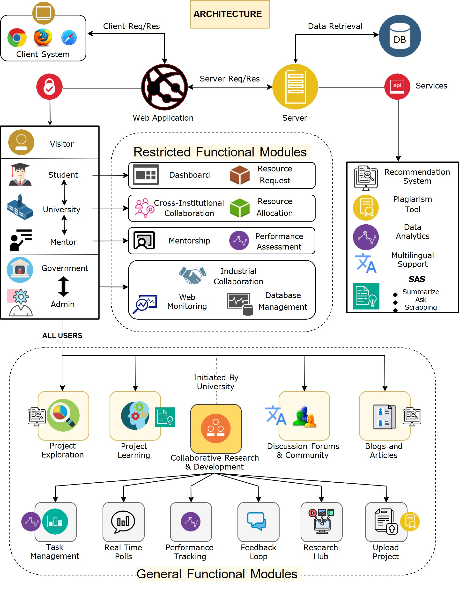

<figure> </figure> 


## Overview

* ### Smart India Hackathon - 2023 Finalist&#x20;
* ### Problem Statement : Online integrated platform for projects taken up by the students of various universities/colleges
* ### Domain Bucket : Smart Education

## Features :&#x20;

1. **Trending Projects** 📈:  Displays popular projects currently gaining traction within the platform, fostering visibility and engagement.

<figure><figcaption><p>Trending Projects</p></figcaption></figure>

2. **Explore Wide Categories of Projects** 🔍:  Offers a diverse range of project categories for users to browse and discover, catering to various interests and fields.

<figure><figcaption><p>Project Categories</p></figcaption></figure>

3. **Smart Recommendation System (SRS Module)** 🧠: Utilizes algorithms to suggest relevant projects based on user preferences and activity, enhancing personalized project discovery.

<figure><figcaption><p>Smart Recommendation System</p></figcaption></figure>

4. **SAS Module:**

* **Summarize** 📝:  Automatically generates concise summaries of project content, aiding in quick understanding and review.


<figure><figcaption><p>Summarize Module</p></figcaption></figure>

* **Ask** ❓: Allows users to inquire about specific project details or information through a conversational interface.


<figure><figcaption><p>Ask with Chatbot </p></figcaption></figure>

* **Web Scraping** 🕸️: Gathers data from web sources to enrich project content and provide comprehensive insights.


<figure><figcaption><p>Web Scrapping Module</p></figcaption></figure>

5. **Student Dashboard** 🎓:  Personalized dashboard for students to manage their projects, tasks, and interactions within the platform.


<figure><figcaption><p>Student Dashboard</p></figcaption></figure>

6. **University Dashboard** 🏫: Administrative interface for universities to oversee projects, collaborations, and student activities.


<figure><figcaption><p>University Dashboard</p></figcaption></figure>

7. **CRD Space - Collaborative Research and Development** 🤝: Shared workspace for multiple universities to collaborate on projects, fostering innovation and knowledge exchange.


<figure><figcaption><p>CRD Space</p></figcaption></figure>

8. **Project Management Tools:**

* **Kanban Board** 📋: Visualizes project tasks and progress for efficient management and tracking.
* **Calendar** 🗓️: Enables scheduling and organization of project-related events and deadlines.
* **Gantt Chart** 📊: Provides a timeline view of project tasks and milestones for planning and monitoring.
* **Chat Support** 💬: Integrated chat functionality for real-time communication and collaboration among project members.


<figure><figcaption><p>Project Management Tools</p></figcaption></figure>

9. **Plagiarism Checker with Automated Plagiarism Report (via Email)** 🕵️‍♂️: Ensures academic integrity by detecting plagiarized content within project submissions and automatically generating detailed reports for users.


<figure><figcaption><p>Automated Plagiarism Report received via Email</p></figcaption></figure>

10. **Admin Dashboard - Detailed Analytics** 📊: Comprehensive analytics and insights for administrators to track platform usage, user engagement, and project performance.


<figure><figcaption><p>Admin Dashboard</p></figcaption></figure>


<figure><figcaption><p>Different statistical metrics of Admin Dashboard</p></figcaption></figure>


<figure><figcaption><p>Event Form functionality in Admin Dashboard</p></figcaption></figure>

11. **Web Analytics Integration** 🌐:  Integration with platforms like Google Analytics and Microsoft Clarity to track and analyze user behavior and website performance.

<figure><figcaption><p>Web Analytics Integration ie : Google Analytics and Microsoft Clarity</p></figcaption></figure>

## System Architecture

<figure><figcaption><p>System Architecture</p></figcaption></figure>

## Project Installation

1.  Navigate to the server directory:

    ```bash
    cd server
    ```
2.  Install server dependencies:

    ```bash
    npm install
    ```
3.  Start the server:

    ```bash
    node index.js
    ```
4. Open a new terminal window/tab.
5.  Navigate to the client directory:

    ```bash
    cd client
    ```
6.  Install client dependencies:

    ```bash
    npm install
    ```
7.  Start the client application:

    ```bash
    npm start
    ```

## Youtube Demonstration (Ideation Phase):

<a href="https://youtu.be/fACKQSzBI7A"> https://youtu.be/fACKQSzBI7A </a>
